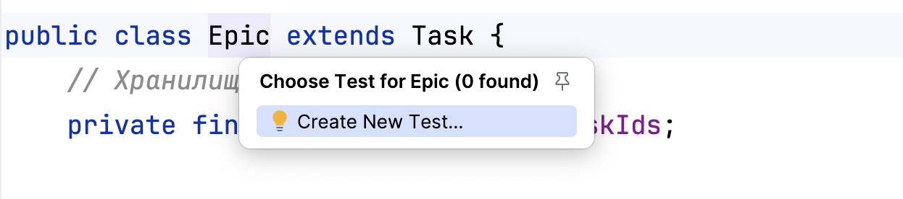
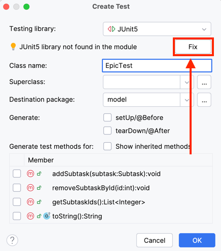
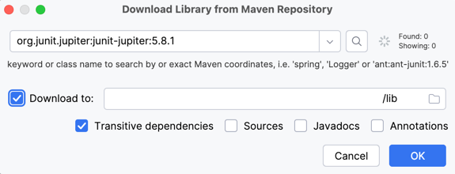
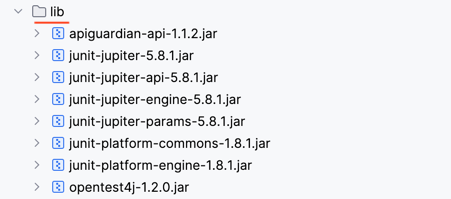

# Техническое задание

Вы знаете, что без тестов нельзя проверить программу и убедиться, что всё работает именно так, как задумано. В трекере
уже есть код проверки — он содержится в методах `main`. На основе этого кода вам предстоит написать тесты для менеджеров и
задач.

### Добавьте JUnit в проект

Прежде чем приступать к написанию тестов, добавьте поддержку JUnit в проект. Для этого выполните в IntelliJ IDEA
следующие действия.

1. Откройте любой класс, например `Epic`.
2. Нажмите Ctrl+Shift+T. В выпадающем меню выберите пункт **Create test** (англ. «Создать тест»). В появившемся окне
   нажмите кнопку **OK** — тест будет размещён в той же папке.
   
3. В меню выбора теста (**Testing library**) выберите **JUnit5**, а затем нажмите кнопку **Fix** (англ. «Исправить»).
   <div style="display: flex; justify-content: center"></div>
4. Скачайте библиотеку в папку **lib**. Поставьте галочку около пункта **Download to** (англ. «Скачать в...») и нажмите
   кнопку **OK**, чтобы подтвердить создание теста.
   <div style="display: flex; justify-content: center"></div>
5. После этого откроется файл **EpicTest**. Можно переходить к написанию тестов.

💡 Проверьте, что все библиотеки загрузились в папку lib.
<div style="display: flex; justify-content: center"></div>

### Покройте код тестами

Ваша цель — написать отдельный тест для каждого публичного метода: стандартный кейс его работы и граничные случаи.

Потребуются следующие тесты.

1. Для расчёта статуса `Epic`. Граничные условия:
    - Пустой список подзадач.
    - Все подзадачи со статусом `NEW`.
    - Все подзадачи со статусом `DONE`.
    - Подзадачи со статусами `NEW` и `DONE`.
    - Подзадачи со статусом `IN_PROGRESS`.
2. Для двух менеджеров задач `InMemoryTasksManager` и `FileBackedTasksManager`.
    - Чтобы избежать дублирования кода, необходим базовый класс с тестами на каждый метод из
      интерфейса `abstract class TaskManagerTest<T extends TaskManager>`.
    - Для подзадач нужно дополнительно проверить наличие эпика, а для эпика — расчёт статуса.
    - Для каждого метода нужно проверить его работу:
        - Со стандартным поведением.
        - С пустым списком задач.
        - С неверным идентификатором задачи (пустой и/или несуществующий идентификатор).
3. Для `HistoryManager` — тесты для всех методов интерфейса. Граничные условия:
    - Пустая история задач.
    - Дублирование.
    - Удаление из истории: начало, середина, конец.
4. Дополнительно для `FileBackedTasksManager` — проверка работы по сохранению и восстановлению состояния. Граничные
   условия:
    - Пустой список задач.
    - Эпик без подзадач.
    - Пустой список истории.

После написания тестов ещё раз проверьте их наличие по списку. Убедитесь, что они работают.
<details>
<summary>Подсказка: примеры тестов</summary>

Тест создания задачи.

```java

@Test
void addNewTask() {
    Task task = new Task("Test addNewTask", "Test addNewTask description", NEW);
    final int taskId = taskManager.addNewTask(task);

    final Task savedTask = taskManager.getTask(taskId);

    assertNotNull(savedTask, "Задача не найдена.");
    assertEquals(task, savedTask, "Задачи не совпадают.");

    final List<Task> tasks = taskManager.getTasks();

    assertNotNull(tasks, "Задачи на возвращаются.");
    assertEquals(1, tasks.size(), "Неверное количество задач.");
    assertEquals(task, tasks.get(0), "Задачи не совпадают.");
}
```

Тест добавления в историю.

```java

@Test
void add() {
    historyManager.add(task);
    final List<Task> history = historyManager.getHistory();
    assertNotNull(history, "История не пустая.");
    assertEquals(1, history.size(), "История не пустая.");
}
```

</details>

### Добавьте продолжительность и дату старта

Добавьте новые поля в задачи:

- `duration` — продолжительность задачи, оценка того, сколько времени она займёт в минутах (число);
- `startTime` — дата, когда предполагается приступить к выполнению задачи.
- `getEndTime()` — время завершения задачи, которое рассчитывается исходя из `startTime` и `duration`.

Менять сигнатуры методов интерфейса `TaskManager` не понадобится: при создании или обновлении задач все его методы будут
принимать и возвращать объект, в который вы добавите два новых поля.

С классом `Epic` придётся поработать дополнительно. Продолжительность эпика — сумма продолжительности всех его подзадач.
Время начала — дата старта самой ранней подзадачи, а время завершения — время окончания самой поздней из задач. Новые
поля `duration` и `startTime` этого класса будут расчётные — аналогично полю статус. Для реализации `getEndTime()`
удобно
добавить поле `endTime` в `Epic` и рассчитать его вместе с другими полями.

Не забудьте также доработать опцию сохранения состояния в файл: добавьте в сериализацию новые поля.

Добавьте в тесты проверку новых полей.

### Выведите список задач в порядке приоритета

Отсортируйте все задачи по приоритету — то есть по `startTime`. Если дата старта не задана, добавьте задачу в конец
списка задач, подзадач, отсортированных по `startTime`. Напишите новый метод `getPrioritizedTasks`, возвращающий список
задач и подзадач в заданном порядке.

Предполагается, что пользователь будет часто запрашивать этот список задач и подзадач, поэтому подберите подходящую
структуру данных для хранения. Сложность получения должна быть уменьшена с `O(n log n)` до `O(n)`.

<details>
<summary>Подсказка: как ускорить сортировку</summary>

Если сортировать список заново каждый раз, сложность получения будет `O(n log n)`. Можно хранить все задачи заранее отсортированными с помощью класса `TreeSet`.
</details>


### Проверьте пересечения

Предполагается, что пользователь будет выполнять не более одной задачи за раз. Научите трекер проверять, что задачи и подзадачи не пересекаются по времени выполнения. Добавьте валидацию во время создания или изменения задач, подзадач.

<details>
<summary>Подсказка: как искать пересечения за O(n)</summary>

`getPrioritizedTasks` возвращает отсортированный список задач. По нему можно пройтись за `O(n)` и проверить все задачи на пересечение.
</details>

Не забудьте перепроверить код перед отправкой на ревью!

Интересного вам программирования!